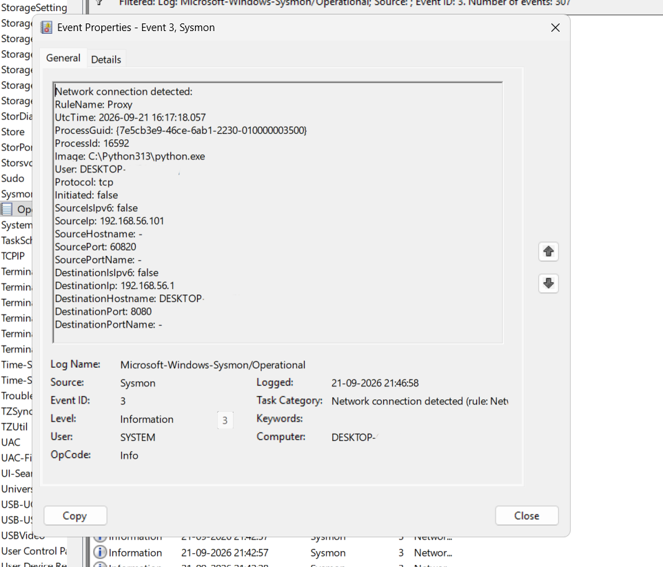

# Home SOC Lab — Blue Team Project #2

A lightweight home SOC lab built on an 8GB RAM host: a Kali Linux VM as the attacker machine, and the host laptop itself (Windows, running Sysmon natively) as the monitored endpoint — no second Windows VM required.

## Table of Contents
- [Goal](#goal)
- [Architecture](#architecture)
- [1. Kali Linux VM Setup](#1-kali-linux-vm-setup)
- [2. Lab Networking (Host-only + NAT)](#2-lab-networking-host-only--nat)
- [3. Sysmon Installation on Host](#3-sysmon-installation-on-host)
- [4. Verifying Sysmon Logging](#4-verifying-sysmon-logging)
- [5. Cross-Machine Visibility Test](#5-cross-machine-visibility-test)
- [6. Troubleshooting Log](#6-troubleshooting-log)
- [7. Result / Proof of Detection](#7-result--proof-of-detection)
- [Lessons Learned](#lessons-learned)
- [Next Steps](#next-steps)

---

## Goal

Build a minimal, resource-constrained home SOC lab that proves a core blue-team fundamental: **attacker activity on one machine is visible and attributable in defender-side logs on another.** This lab is the foundation for later projects in the series (log analysis, mini SIEM, attack→detection lab, full IR lab).

**Constraint:** 8GB RAM host — ruled out running a separate Windows victim VM alongside Kali. Solved by using the real host laptop as the "endpoint" directly.

---

## Architecture

```
┌─────────────────────┐         Host-only (192.168.56.0/24)        ┌──────────────────────────┐
│   Kali Linux VM      │ ───────────────────────────────────────►  │   Windows Host (real)     │
│   192.168.56.101      │        (isolated lab network)             │   192.168.56.1             │
│   (Attacker)          │                                            │   Sysmon (Defender/Logging)│
│                        │                                            │                            │
│   Adapter 2: NAT ──────┼──► Internet (updates, tool downloads)      │                            │
└─────────────────────┘                                            └──────────────────────────┘
```

---

## 1. Kali Linux VM Setup

- Hypervisor: VirtualBox
- Image: Kali Linux 2026.2, pre-built VirtualBox OVA (not the ISO — faster setup)
- Allocated resources:
  - RAM: 2048 MB
  - CPU: 2 cores
  - Disk: 80GB (dynamically allocated)


---

## 2. Lab Networking (Host-only + NAT)

Two adapters configured on the Kali VM:

| Adapter | Type | Purpose |
|---|---|---|
| Adapter 1 | Host-only | Isolated private link between Kali and host — the "lab network" |
| Adapter 2 | NAT | Internet access for `apt update` / tool downloads |

.png)

Verified with `ip a` on Kali:
- `eth0` → `192.168.56.101/24` (Host-only)
- `eth1` → `10.0.3.15/24` (NAT)

---

## 3. Sysmon Installation on Host

Installed **natively on the real Windows laptop** (not inside a VM) — keeps resource usage low while still getting endpoint-level visibility.

Steps:
1. Downloaded Sysmon from Microsoft Sysinternals
2. Downloaded SwiftOnSecurity's community Sysmon config (`sysmonconfig-export.xml`) — **note:** downloaded via GitHub's raw file button, not "Save As" on the rendered page, to avoid saving an HTML wrapper instead of the actual XML
3. Installed via elevated PowerShell:
   ```powershell
   cd C:\Sysmon
   .\Sysmon64.exe -accepteula -i sysmonconfig-export.xml
   ```
4. Verified service status:
   ```powershell
   Get-Service Sysmon*
   ```


---

## 4. Verifying Sysmon Logging

Confirmed logs were flowing by checking:
```
Event Viewer → Applications and Services Logs → Microsoft → Windows → Sysmon → Operational
```

Result: tens of thousands of events generated from normal background activity — mostly **Event ID 1** (process creation) and **Event ID 13** (registry value set).

---

## 5. Cross-Machine Visibility Test

Goal: generate real traffic from Kali toward the host, and confirm it's visible and attributable in the host's Sysmon logs.

**Test 1 — Connectivity (ping):**
```bash
# On Kali
ping -c 4 192.168.56.1
```
Initially failed (100% packet loss, no host-unreachable response) — see [Troubleshooting Log](#6-troubleshooting-log).

**Test 2 — Actual scanned connection (nmap):**
```bash
# On Kali
nmap -sV -p 8000 192.168.56.1
```
Required a real listening process on the host first (see troubleshooting below) — otherwise Windows Firewall drops the packet before any process can accept it, so Sysmon has nothing to attribute.


**Confirmed detection** — filtered Sysmon log on host for Event ID 3 (Network connection detected), found:



```
SourceIp: 192.168.56.101        ← Kali VM
SourcePort: 60820
DestinationIp: 192.168.56.1     ← Windows host
DestinationPort: 8080
```

---

## 6. Troubleshooting Log

Documenting real issues hit during the build — useful both for your own reference and as content, since these are realistic "gotchas."

### Issue 1: Ping from Kali to host timed out (100% packet loss)
- **Symptom:** `ping -c 4 192.168.56.1` from Kali returned 100% packet loss, no error response.
- **Cause:** Windows Firewall default rules block inbound ICMP Echo Request on unclassified/public-profile networks.
- **Fix:** Added a scoped inbound firewall rule allowing ICMP only from the lab subnet:
  ```powershell
  New-NetFirewallRule -DisplayName "Allow ICMP from Lab Network" -Protocol ICMPv4 -IcmpType 8 -Direction Inbound -RemoteAddress 192.168.56.0/24 -Action Allow
  ```
- **Result:** Ping succeeded afterward (0% packet loss).


### Issue 2: nmap scan generated no Sysmon Event ID 3 logs
- **Symptom:** After confirming ping worked, an `nmap -sV` scan against the host produced zero matching Sysmon events for Kali's IP.
- **Cause:** Sysmon's Event ID 3 only logs a connection when a **process** actually accepts/initiates it. Windows Firewall was silently dropping the scanned ports before any process could accept the connection — nothing for Sysmon to attribute.
- **Fix:** Started an actual listening process on the host (`python -m http.server 8000`, later tested on port 8080) so there was a real process accepting the connection, then re-scanned from Kali.
- **Result:** Event ID 3 log entry appeared, correctly attributing the connection to Kali's source IP and port.

---

## 7. Result / Proof of Detection

Final confirmed log entry (Sysmon Event ID 3, Network connection detected):

| Field | Value |
|---|---|
| SourceIp | 192.168.56.101 (Kali) |
| SourcePort | 60820 |
| DestinationIp | 192.168.56.1 (Windows host) |
| DestinationPort | 8080 |

This confirms end-to-end visibility: an action taken on the attacker VM is captured, attributed, and queryable on the defender side.

---

## Lessons Learned

- Default OS firewalls block more than expected — even in an "isolated" lab network, ICMP and unsolicited connections are blocked by default and need explicit rules.
- Endpoint logging tools (Sysmon) only log what actually reaches a process — a scan that's blocked at the firewall layer produces **no** log entry, which itself is a detection-relevant fact (blocked ≠ invisible, but it does mean no Sysmon Event ID 3).
- Running the "victim" role on a real host instead of a VM is a legitimate way to save resources without losing the learning value, as long as you're careful about isolating the lab network from your real home network.

---

## Next Steps

- Project 3: Log Analysis & Threat Hunting — using this same Kali + host Sysmon setup, generate a broader set of suspicious activity and practice identifying it in the logs.
- Take a VirtualBox snapshot of the current clean Kali VM state before running heavier attack simulations in later projects.
